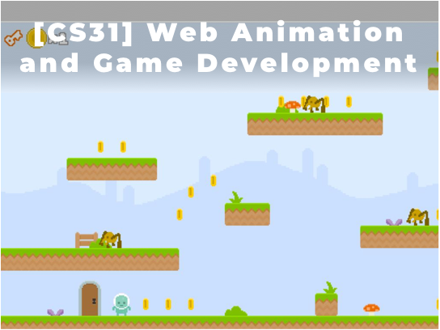
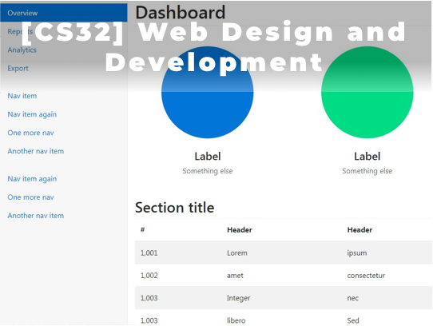
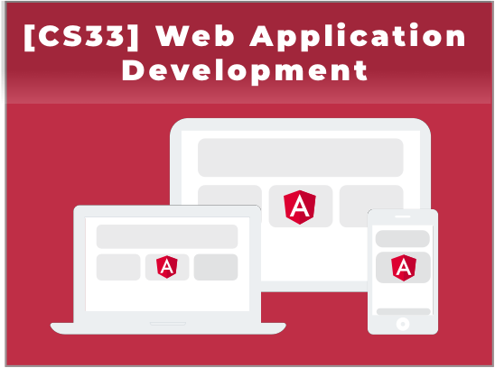

# CS APPLICATION

|                    |                                    |
| ------------------ | ---------------------------------- |
| Length             | 4 Courses (CS31, CS32, CS33, CS34) |
| Recommended Grades | 7th and up                         |
| Prerequisites      | CS Foundation Track                |
| Schedule           | [2018 Schedule](Schedule.md)       |

In this Computer Science Application Track, students will learn how to develop the advanced applications for desktop, web and mobile with the latest industry standard technologies and tools, including JavaScript, HTML5 and CSS, VSCODE IDEA, Typescript, Angular, Ionic and Node.js. By working through fun projects, students will also learn the core software development principles. More importantly, they will learn the common structures in applications and how to apply them to learn new technologies more quickly. By the end of this track, students will have a strong foundation of developing applications and move on to more advanced applications.
  

## [CS31] Web Animation and Game Development
This is the first course in Computer Science Application Track. Students will learn the constructs of JavaScript programming and how to build animations, interactive art and games in Typescript. Also, students will learn how to publish websites with animations and interactive games. Quizzes and homework will be assigned on a weekly basis.
   

## [CS32] Web Design and Development
This is the second course in Computer Science Application Track. Students will learn the constructs of HTML5 and CSS for web designing and styling. Students will also learn how to integrate CSS and JavaScript to give a professional look and feel. Quizzes and homework will be assigned on a weekly basis.
   

## [CS33] Web App Development in Angular
This is the third course in Computer Science Application Track. Students will learn Google Angular framework, which is the latest application development technology. By learning Angular framework, student will be able to build applications suitable for all platforms, such as web, mobile web, native mobile, and native desktop. Quizzes and homework will be assigned on a weekly basis.
   

## [CS34] Mobile App Development in Ionic
This is the fourth course in Computer Science Application Track. Students will learn Ionic 2, one of the most popular open source frameworks especially for building mobile applications. Students will learn how to develop their own mobile applications and how to publish it. Quizzes and homework will be assigned on a weekly basis.
   