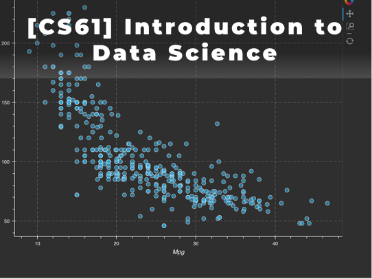
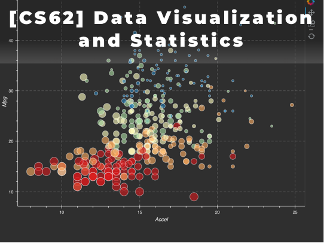
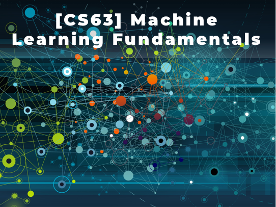
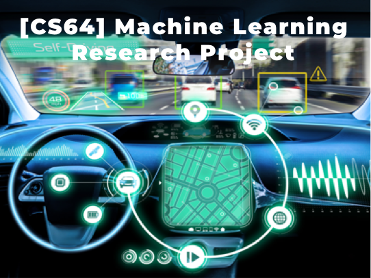

# CS DATA SCIENCE
|                    |                                    |
| ------------------ | ---------------------------------- |
| Length             | 4 Courses (CS61, CS62, CS63, CS64) |
| Recommended Grades | 9th and up                         |
| Prerequisites      | CS Foundation Track                |
| Schedule           | [2018 Schedule](Schedule.md)       |

Data Science is an interdisciplinary study of mathematics, statistics, information science, and
computer science to extract valued insights through big data. The term “data science” was
initially used as new technology enabling companies to target marketing with vast amounts of data
about consumers. But now every field including economists, lawyers, engineers and medical
researchers use data science to find solutions for their challenging issues. The New York Times
emphasized that this hot new field promises to revolutionize industries from business to
government, health care to academia.

Now the demand for skilled data science practitioners is significantly growing.  According to
Glassdoor, the job search website, a data scientist is the best job in the U.S 2016, 2017 and 2018
in a row.  Also, Harvard Business Review called the profession of data scientist as the “Sexiest
Job of the 21 Century”.

Our one-year Data Science Track is designed for high school and college students to learn
fundamental knowledge and research skills necessary for the research-related internship as well as
job opportunities in any field. Professional data scientists will teach data processing, data
visualization with statistics, and predictive machine learning models with motivating case
studies. In the end, students will participate in data science research projects with challenging
real-world issues. Students can have an opportunity to participate in data science competitions
with mentorship and can receive a letter of recommendation from instructors.

## [CS61] Introduction to Data Science
This is the first course of CS Data Science Track. This course introduces a collection of powerful tools for data analysis such as Jupiter Notebook, Numpy, Pandas, Matplotlib, Git and more. Students will learn hands-on knowledge on data processing. This course also provides the foundation for the later courses in the data visualization and machine learning.
   

## [CS62] Data Visualization and Statistics
Visualization is one key approach to gaining insight from this mountain of data. It enables the trends and patterns, to be examined and assessed. Data Visualization tools in the Python (Matplotlib) platforms will be covered in the course. Students will also learn the foundation of statistics, probability. They will be given many opportunities to apply theories they’ve learned.
   

## [CS63] Machine Learning Fundamentals
This course is the third course of CS Data Science Track. There is heavy and growing demand for computer scientists who have ‘Machine Learning’ skills. This course will cover the underlying mathematical concepts for a wide variety of Machine Learning methods and algorithms, plus various procedures used to assess the value and validity of them.
   

## [CS64] Machine Learning Research Projects
This course is the final course of CS Data Science Track. This course is designed to challenge students with real-world machine learning problems. The instructor will introduce several open dataset competitions on real world issues that current data scientists are trying to solve in the areas of government, health, and science. Instructors will guide students to explore and build predictive models.
   

# INSTRUCTOR INFORMATION

## DR. ASH PAHWA
Ash Pahwa, Ph.D., is an educator, author, entrepreneur, and technology visionary with three decades of industry and academic experience. Dr. Pahwa currently teaches a data science course, “Advanced Analytics: Machine Learning Using R and Python.” at California Institute of Technology.

Dr. Pahwa earned his doctorate in Computer Science from the Illinois Institute of Technology in Chicago. He is listed in Who's Who in the Frontiers of Science and Technology. He is also a Google Certified Analytics Consultant.

In Industry, Dr. Pahwa has worked for General Electric, AT&T Bell Laboratories, Xerox Corporation, and Oracle. He founded CD-Gen, Inc. and DV Studio Technologies, LLC., which introduced successful products for CD- Recording (CDR), MPEG encoding, and videotape-to-DVD archiving. His book, CD-Recordable Bible, has been published in English, Japanese, and German.

## TAEHEE JUNG, CFA
Taehee Jung is a vice president and senior developer at PIMCO, focused on client management technologies and analytics. Prior to joining PIMCO in 2010, he was with 20th Century FOX as a senior consultant, and National Bankers Group Inc as a computer information system director.

In addition, he has many years of experience in teaching various computer science courses for undergraduate and master students at private institutes. He received an undergraduate and master degree in computer science from the University of Southern California.

He has 20 years of professional and educational experience, holds an Oracle Certified Java Developer, and a Chartered Financial Analyst (CFA).
