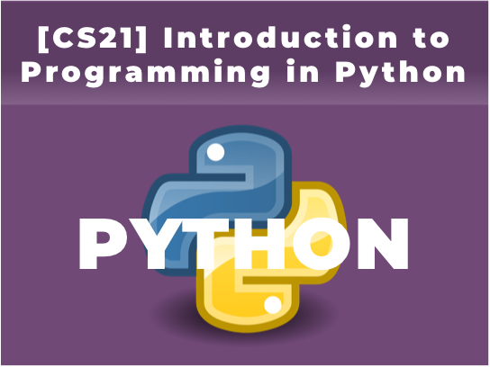
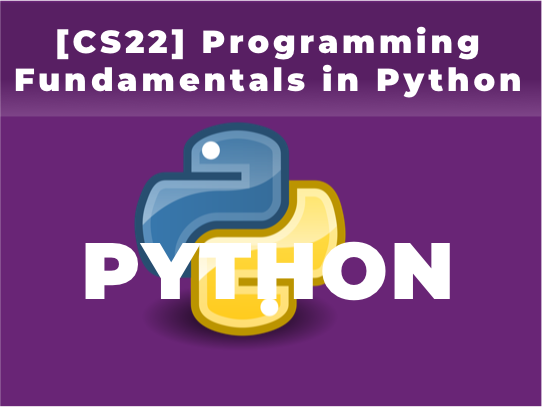

# CS FOUNDATION
|                    |                              |
| ------------------ | ---------------------------- |
| Length             | 2 Courses (CS21, CS22)       |
| Recommended Grades | 7th and up                   |
| Prerequisites      | None                         |
| Schedule           | [2018 Schedule](Schedule.md) |

In this Computer Science Foundation Track, students will learn essential concepts for programming principles by using Python. Python is an expressive programming language to facilitate the learning of complex programming principles and, also a popular versatile language even suitable for data science. By the end of this track, students will have a strong foundation of programming principles and logical computational thinking to move on to learn how to develop the advanced applications.

## [CS21] Introduction to Programming in Python
This is the first course in Computer Science Foundation Track. By learning Python programming, students will learn essential programming concepts, such as variables, constants, operators, expressions, conditional statements, loops, and functions. Quizzes and homework will be assigned on a weekly basis.
  

## [CS22] Programming Fundamentals in Python
This is the second course in Computer Science Foundation Track. Students will learn string, list, range sequences, the power of list iteration, string and list methods. Also, students will learn the data structures and other practical tasks of Python programming. Quizzes and homework will be assigned on a weekly basis.
 