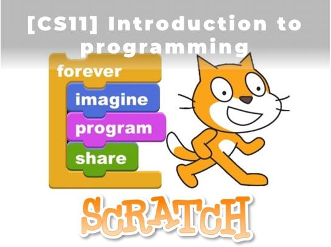
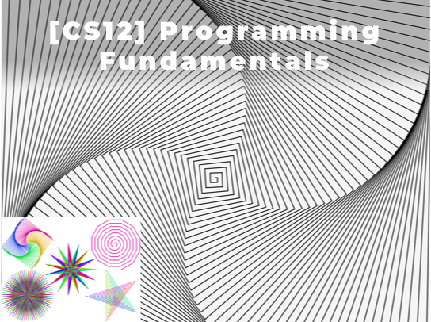
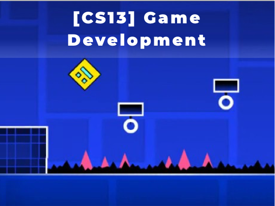
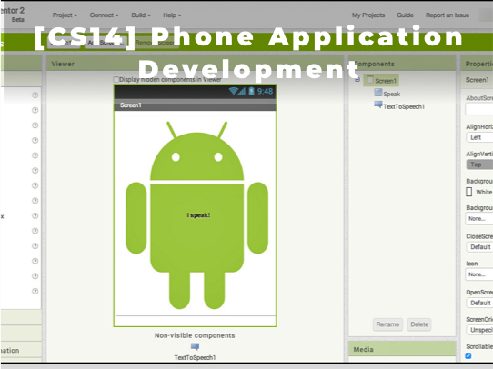

# CS PRINCIPLE
  
|                    |                                    |
| ------------------ | ---------------------------------- |
| Length             | 4 Courses (CS11, CS12, CS13, CS14) |
| Recommended Grades | 4th – 6th                          |
| Prerequisites      | None                               |
| Schedule           | [2018 Schedule](Schedule.md)       |

In this Computer Science Principle Track, students will learn essential concepts for programming principles by learning Scratch and App Inventor. Both Scratch and App Inventor are block-based programming languages developed by MIT. Scratch and App Inventor are visually powerful to facilitate the learning of complex programming principles. Students will also learn how to create interactive data-oriented animations and games and how to share their creations with others. By the end of this track, students will have a strong foundation for programming principle and logical computational thinking to move on to more advanced tracks.

## [CS11] Introduction to Programming in Scratch
This is the first course in Computer Science Principle Track. Students will learn essential programming concepts, such as variables, operators, expressions, conditional statements, loops, and functions. Also, students will learn how to create basic interactive animations and games. Quizzes and homework will be assigned on a weekly basis.
   

## [CS12] Programming Fundamentals in Scratch
This is the second course in Computer Science Principle Track. On top of the essential programming concepts, students will learn more advanced programming concepts, such as string, list manipulation, and recursions. Also, students will learn how to create more advanced data-oriented animations and games. Quizzes and homework will be assigned on a weekly basis.
   

## [CS13] Game Development in Scratch
This is the third course in Computer Science Principle Track. With all the programming concepts, students will focus on developing more complicated and interactive games. Also, students will learn how to publish and share their creations with others in the world. By working through projects, students will also learn the basic life cycle of computer science. Quizzes and homework will be assigned on a weekly basis.
  

## [CS14] Mobile App Development in AppInventor
This is the last course in Computer Science Principle Track. Students will learn the essential constructs of App Inventor and how to design and develop functional mobile apps for smartphones and tablets. Quizzes and homework will be assigned on a weekly basis.
  
