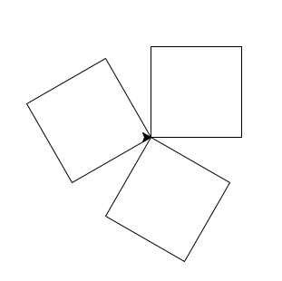
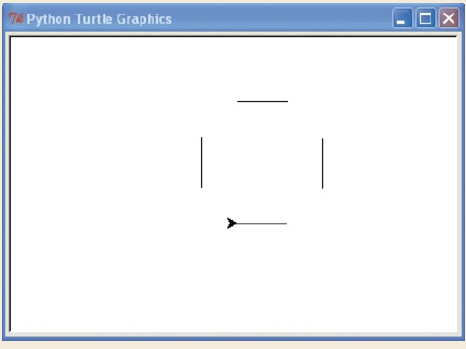
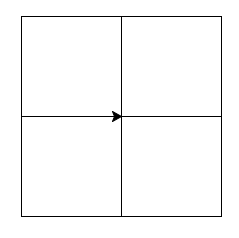
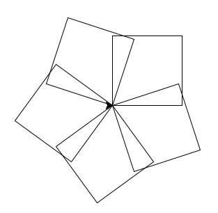
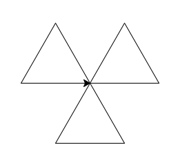
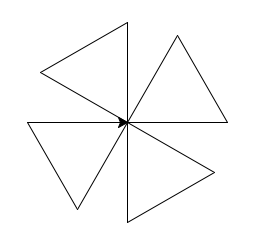
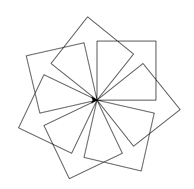
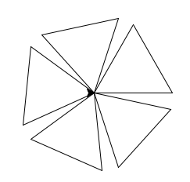
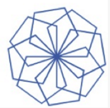
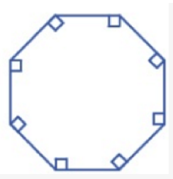

# Drawing with Turtles

## Import module
- computer graphic module

```
import turtle
```

## Create a canvas
```
p = turtle.Pen()
```

## Move the turtle 50 pixels
- pixel: the smallest unit on the screen

```
p.forward(50)
```

## Turn left 90 degrees
- the direction you're facing is 0 degree
- p.left(90) == p.right(270)

```
p.left(90)
```

## Draw a square
1. manual
```
p.forward(100)
p.left(90)
p.forward(100)
p.left(90)
p.forward(100)
p.left(90)
p.forward(100)
p.left(90)
```
2. using loop
```
for i in range(4):
    p.forward(100)
    p.left(90)
```

## Reset
- reset: clear the canvas and puts the turtle back at its startig position
- clear: clear the canvas

```
t.reset()
```

## Other commands
- p.backward(100)   
  * move pen backward 100 pixels
- p.up()
  * lift the pen off the page
- p.down()
  * start Drawing


## draw two parellel lines

```
t.reset()
t.backward(100)
t.up()
t.right(90)
t.forward(20)
t.left(90)
t.down()
t.forward(100)
```

## Rotated shape
<p></p>

```
import turtle
x = 3
pen = turtle.Pen()
for j in range(x):
    for i in range(4):
        pen.forward(100)
        pen.left(90)
    pen.left(360/x)
turtle.done()
```

### Exercise 1
Create a program to draw a equilateral triangle.

### Exercise 2
Create a program to draw the following shape.
<p></p>

### Exerciase 3
Create a program to draw the following shape.
<p></p>

### Exerciase 4
Create a program to draw the following shape.
<p></p>

### Exerciase 5
Create a program to draw the following shape.
<p></p>

### Exerciase 6
Create a program to draw the following shape.
<p></p>

### Exercise 7
Create a program to draw Pentagon(5 sides).

### Exercise 8
Create a program to draw Hexagon(6 sides).

### Exercise 9
Create a program to draw Heptagon.(7 sides)

### Exercise 10
Create a program to draw the following shape.
<p></p>

### Homework 1
Create a program to draw the following shape.
<p></p>

### Homework 2
Create a program to draw the following shape.
<p></p>

### Homework 3
Create a program to draw the following shape.
<p></p>

### Homework 4
Create a program to draw the following shape.
<p></p>
