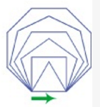
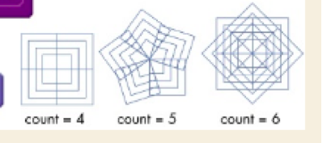
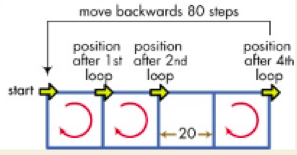
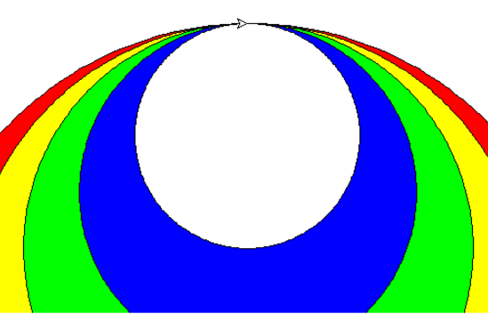

# Function 
- 4 components: name, parameter, body and return
- parameter: function input
- argument: a value to a parameter

### Draw squaren with size
```
import turtle

pen = turtle.Pen()
pen.pensize(2)
pen.pencolor("red")

def drawSquare(size):
    for i in range(4):
        pen.forward(size)
        pen.left(90)

drawSquare(100)

turtle.done()
```

### Draw square with size, pensize, pencolor, 

### Draw polygons with various side
Create a program to draw the following shape.
<p></p>

### Polygons, side, size, pensize, pencolor


### Rotated square
Create a program to rotate a square with a given number.
<p></p>

### Draw checker
Create a function to draw checker with number of rows and number of columns.
<p></p>

## exercise 1
Please write a function to draw rectangle.
parameter: length, width

## exercise 2
Please write a function to draw a rectangle.
parameter: length, width, x, y, penColor, fillColor

## exercise 3
Please write a function to draw a circle.
parameter: radius, x, y, penColor, fillColor

## exercise 4
Please write a program to draw the following.
<p></p>